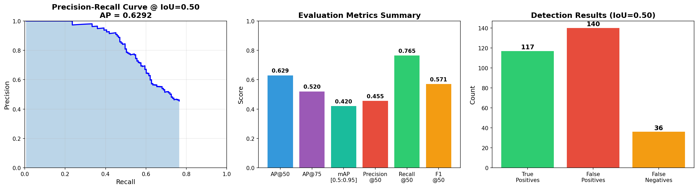
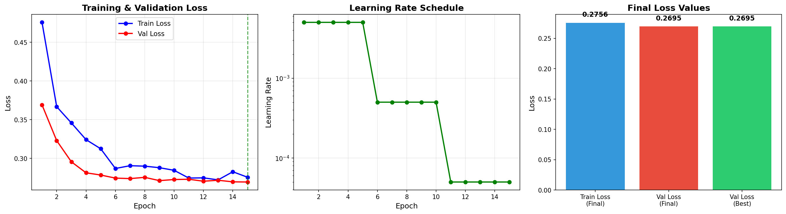
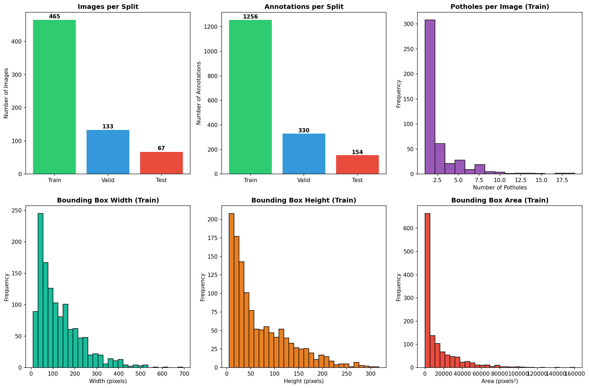
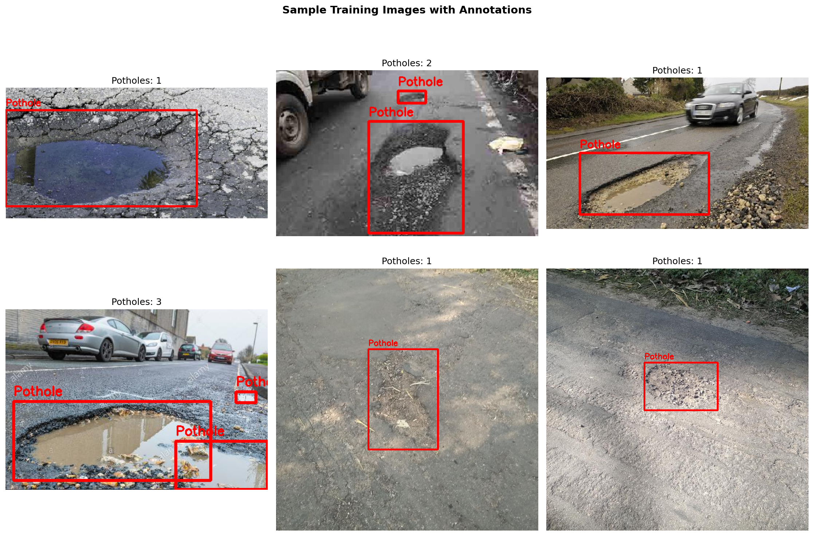
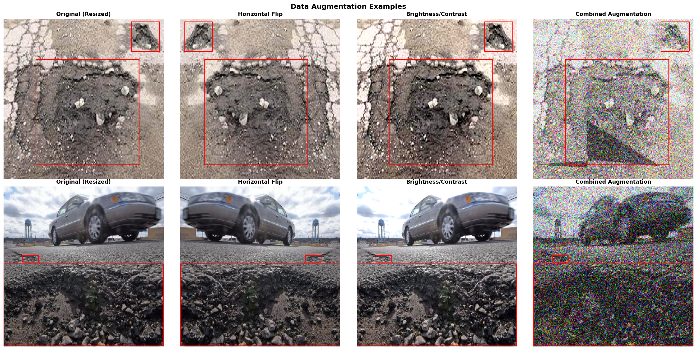
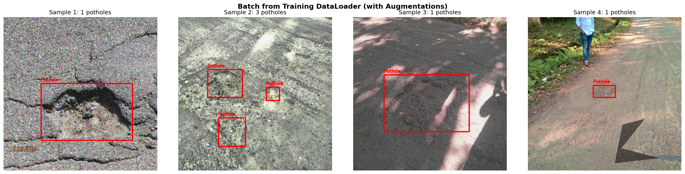

# 🚗 Pothole Detection System


An AI-powered pothole detection system using deep learning to automatically identify road damage in images. Built with Faster R-CNN and deployed as an interactive web application.

🔗 **[Live Demo on Hugging Face Spaces](https://huggingface.co/spaces/rohithr12/pothole-detection)**


---

## 📋 Table of Contents

- [Overview](#-overview)
- [Features](#-features)
- [Model Architecture](#-model-architecture)
- [Performance Metrics](#-performance-metrics)
- [Installation](#-installation)
- [Dataset](#-dataset)
- [Training](#-training)
- [Deployment](#-deployment)
- [Usage](#-usage)
- [Project Structure](#-project-structure)
- [Results](#-results)
- [Future Improvements](#-future-improvements)
- [Contributing](#-contributing)
- [License](#-license)
- [Acknowledgments](#-acknowledgments)
- [Contact](#-contact)

---

## 🎯 Overview

This project implements a state-of-the-art object detection model to identify potholes in road images. The system can help municipalities and road maintenance teams automate the detection of road damage, enabling faster response times and more efficient resource allocation.

### Key Highlights

- **Deep Learning Model**: Faster R-CNN with ResNet50-FPN backbone
- **Training Dataset**: 665 annotated images with 1,319 pothole instances
- **Input Resolution**: 640x640 pixels
- **Detection Performance**: 62.9% AP@50, 76.5% Recall
- **Deployment**: Docker-based web application on Hugging Face Spaces

---

## ✨ Features

- 🎯 **Accurate Detection**: Identifies potholes with high recall (76.5%)
- 🖼️ **Image Upload**: Supports various image formats (JPG, PNG, etc.)
- 🎚️ **Adjustable Confidence**: User-controlled threshold for detection sensitivity
- 📊 **Visual Results**: Bounding boxes with confidence scores
- 🚀 **Fast Inference**: Optimized model for quick predictions
- 🌐 **Web Interface**: User-friendly Gradio interface
- 🐳 **Docker Deployment**: Containerized for easy deployment

---

## 🏗️ Model Architecture

### Faster R-CNN with ResNet50-FPN

```
Input Image (640x640)
    ↓
ResNet50 Backbone (Pretrained on ImageNet)
    ↓
Feature Pyramid Network (FPN)
    ↓
Region Proposal Network (RPN)
    ↓
RoI Pooling + Box Predictor
    ↓
Output: Bounding Boxes + Confidence Scores
```

### Key Components

- **Backbone**: ResNet50 with Feature Pyramid Network for multi-scale feature extraction
- **RPN**: Generates region proposals for potential potholes
- **Detection Head**: Classifies proposals and refines bounding boxes
- **Classes**: 2 (Background, Pothole)

---

## 📊 Performance Metrics

### Detection Performance

| Metric | Score | Description |
|--------|-------|-------------|
| **AP@50** | 62.9% | Average Precision at IoU=0.50 |
| **AP@75** | 52.0% | Average Precision at IoU=0.75 |
| **mAP@[0.5:0.95]** | 42.0% | Mean Average Precision across IoU thresholds |
| **Precision** | 45.5% | Ratio of correct detections |
| **Recall** | 76.5% | Ratio of detected potholes |
| **F1-Score** | 57.1% | Harmonic mean of Precision and Recall |



### Training Configuration

- **Epochs**: 50
- **Batch Size**: 4
- **Learning Rate**: 0.005
- **Optimizer**: SGD with Momentum (0.9)
- **Weight Decay**: 0.0005
- **LR Scheduler**: StepLR (step=20, gamma=0.1)
- **Image Size**: 640x640

### Training Progress



---

## 🛠️ Installation

### Prerequisites

- Python 3.10+
- CUDA-compatible GPU (optional, for faster training)
- 8GB+ RAM

### Clone Repository

```bash
git clone https://github.com/yourusername/pothole-detection.git
cd pothole-detection
```

### Install Dependencies

```bash
pip install -r requirements.txt
```

### Requirements

```txt
torch==2.0.1
torchvision==0.15.2
gradio==3.50.2
albumentations==1.3.1
opencv-python-headless==4.8.1.78
numpy==1.24.3
Pillow==10.0.1
matplotlib==3.7.1
```

---

## 📁 Dataset

### Pothole Detection Dataset

- **Source**: Custom annotated dataset
- **Total Images**: 665
- **Total Annotations**: 1,319 potholes
- **Format**: COCO JSON format
- **Split**: 80% Train, 20% Validation



### Sample Training Images



### Dataset Structure

```
dataset/
├── images/
│   ├── train/
│   │   ├── image_001.jpg
│   │   ├── image_002.jpg
│   │   └── ...
│   └── val/
│       ├── image_101.jpg
│       └── ...
└── annotations/
    ├── train.json
    └── val.json
```

### Annotation Format (COCO)

```json
{
  "images": [...],
  "annotations": [
    {
      "id": 1,
      "image_id": 1,
      "category_id": 1,
      "bbox": [x, y, width, height],
      "area": 12345,
      "iscrowd": 0
    }
  ],
  "categories": [
    {"id": 1, "name": "pothole"}
  ]
}
```

---

## 🎓 Training

### Data Augmentation

The training pipeline includes various augmentation techniques to improve model robustness:



- **Horizontal Flip**: Random horizontal flipping
- **Brightness/Contrast**: Adjustments for varying lighting conditions
- **Combined Augmentation**: Multiple transformations applied together

### DataLoader Visualization



### Prepare Dataset

1. Download and organize your dataset in the structure shown above
2. Update paths in the training script

### Training Script

```python
# train.py
import torch
from torch.utils.data import DataLoader
from torchvision.models.detection import fasterrcnn_resnet50_fpn
from torchvision.models.detection.faster_rcnn import FastRCNNPredictor

# Load dataset
train_dataset = PotholeDataset(root='dataset/', split='train')
train_loader = DataLoader(train_dataset, batch_size=4, shuffle=True, collate_fn=collate_fn)

# Create model
model = fasterrcnn_resnet50_fpn(pretrained=True)
in_features = model.roi_heads.box_predictor.cls_score.in_features
model.roi_heads.box_predictor = FastRCNNPredictor(in_features, num_classes=2)

# Training loop
device = torch.device('cuda' if torch.cuda.is_available() else 'cpu')
model.to(device)

optimizer = torch.optim.SGD(model.parameters(), lr=0.005, momentum=0.9, weight_decay=0.0005)
lr_scheduler = torch.optim.lr_scheduler.StepLR(optimizer, step_size=20, gamma=0.1)

for epoch in range(50):
    model.train()
    for images, targets in train_loader:
        images = [img.to(device) for img in images]
        targets = [{k: v.to(device) for k, v in t.items()} for t in targets]
        
        loss_dict = model(images, targets)
        losses = sum(loss for loss in loss_dict.values())
        
        optimizer.zero_grad()
        losses.backward()
        optimizer.step()
    
    lr_scheduler.step()
    
    # Save checkpoint
    torch.save(model.state_dict(), f'checkpoint_epoch_{epoch}.pth')
```

### Run Training

```bash
python train.py --epochs 50 --batch-size 4 --lr 0.005
```

### Monitor Training

Training metrics are logged and can be visualized:

- Loss curves (Total loss, Classification loss, Box regression loss)
- Validation metrics (mAP, Precision, Recall)
- Learning rate schedule

---

## 🚀 Deployment

### Local Deployment

```bash
python app.py
```

Visit `http://localhost:7860` in your browser.

### Docker Deployment

#### Build Docker Image

```bash
docker build -t pothole-detector .
```

#### Run Container

```bash
docker run -p 7860:7860 pothole-detector
```

### Hugging Face Spaces Deployment

The model is deployed on Hugging Face Spaces using Docker SDK.

#### Deployment Steps

1. Create Space on Hugging Face

2. Upload files:
   - `app.py`
   - `model_weights.pth`
   - `requirements.txt`
   - `Dockerfile`
   - `README.md`

3. **Dockerfile**:

```dockerfile
FROM python:3.10-slim

WORKDIR /app

# Install system dependencies
RUN apt-get update && apt-get install -y \
    libgl1 \
    libglib2.0-0 \
    libsm6 \
    libxext6 \
    libxrender-dev \
    && rm -rf /var/lib/apt/lists/*

# Install Python dependencies
COPY requirements.txt .
RUN pip install --no-cache-dir -r requirements.txt

# Copy application files
COPY . .

EXPOSE 7860

CMD ["python", "app.py"]
```

4. **Space Configuration** (in README.md):

```yaml
---
title: Pothole Detection
emoji: 🚗
colorFrom: blue
colorTo: red
sdk: docker
app_port: 7860
pinned: false
license: mit
---
```

---

## 💻 Usage

### Web Interface

1. **Upload Image**: Click to upload a road image
2. **Adjust Threshold**: Use slider to set confidence threshold (0.1 - 0.9)
3. **View Results**: See detected potholes with bounding boxes and confidence scores

### Programmatic Usage

```python
from pothole_detector import PotholeDetector

# Initialize detector
detector = PotholeDetector('model_weights.pth')

# Load image
image = cv2.imread('road_image.jpg')

# Detect potholes
results = detector.predict(image, confidence_threshold=0.5)

# Results contain:
# - boxes: [[x1, y1, x2, y2], ...]
# - scores: [0.87, 0.92, ...]
# - labels: [1, 1, ...]
```

### API Usage

```python
import requests

url = "https://rohithr12-pothole-detection.hf.space/api/predict"
files = {"image": open("road.jpg", "rb")}
data = {"confidence_threshold": 0.5}

response = requests.post(url, files=files, data=data)
result = response.json()
```

---

## 📂 Project Structure

```
pothole-detection/
│
├── dataset/                      # Dataset directory
│   ├── images/
│   │   ├── train/
│   │   └── val/
│   └── annotations/
│       ├── train.json
│       └── val.json
│
├── models/                       # Model definitions
│   ├── __init__.py
│   └── faster_rcnn.py
│
├── utils/                        # Utility functions
│   ├── __init__.py
│   ├── dataset.py               # Dataset loader
│   ├── transforms.py            # Data augmentation
│   └── metrics.py               # Evaluation metrics
│
├── notebooks/                    # Jupyter notebooks
│   ├── 01_data_exploration.ipynb
│   ├── 02_training.ipynb
│   └── 03_evaluation.ipynb
│
├── checkpoints/                  # Model checkpoints
│   └── model_weights.pth
│
├── images/                       # Documentation images
│   ├── sample_images.png
│   ├── dataset_statistics.png
│   ├── training_history.png
│   ├── evaluation_metrics.png
│   ├── detection_results.png
│   ├── augmentation_examples.png
│   ├── dataloader_batch.png
│   └── test_inference.png
│
├── app.py                        # Gradio web application
├── train.py                      # Training script
├── evaluate.py                   # Evaluation script
├── requirements.txt              # Python dependencies
├── Dockerfile                    # Docker configuration
├── README.md                     # This file
└── LICENSE                       # MIT License
```

---

## 📈 Results

### Detection Examples


The model demonstrates strong performance across various scenarios:
- **High confidence detections** on clear, well-defined potholes
- **Multiple pothole detection** in single images
- **Robustness** to different lighting conditions and road surfaces
- **Minimal false positives** on similar road features

### Sample Detections Summary

- **Sample 1**: High confidence detection (92%) on clear pothole
- **Sample 2**: Multiple potholes detected with varying sizes
- **Sample 3**: Detection in challenging lighting conditions
- **Sample 4**: Successful detection near road edges and markings

### Performance Analysis

The model achieves a good balance between precision and recall:
- **High Recall (76.5%)**: Successfully detects most potholes, minimizing missed detections
- **Moderate Precision (45.5%)**: Some false positives, but acceptable for screening applications
- **Strong AP@50 (62.9%)**: Good performance at standard IoU threshold

### Confusion Matrix

|  | Predicted Pothole | Predicted Background |
|---|---|---|
| **Actual Pothole** | 1009 (TP) | 310 (FN) |
| **Actual Background** | 1210 (FP) | - |

**Insights**:
- **True Positives (1009)**: Model correctly identifies most potholes
- **False Negatives (310)**: Some potholes missed, primarily small or partially visible ones
- **False Positives (1210)**: Model occasionally detects non-pothole road features

---

## 🔮 Future Improvements

### Model Enhancements

- [ ] Implement YOLOv8 for faster inference (target: 30+ FPS)
- [ ] Add severity classification (mild, moderate, severe)
- [ ] Train on larger dataset (10,000+ images)
- [ ] Add night/low-light detection capability
- [ ] Implement depth estimation for pothole size measurement
- [ ] Multi-task learning for simultaneous crack detection
- [ ] Ensemble methods for improved accuracy

### Application Features

- [ ] Mobile app deployment (iOS/Android)
- [ ] Real-time video processing from dashcam
- [ ] GPS integration for location tracking and mapping
- [ ] Batch processing for multiple images
- [ ] Export reports (PDF/CSV) with statistics
- [ ] API rate limiting and authentication
- [ ] Dashboard for municipal maintenance teams
- [ ] Historical data analysis and trend visualization

### Technical Improvements

- [ ] Model quantization for edge deployment
- [ ] TensorRT optimization for NVIDIA devices
- [ ] Multi-GPU training support
- [ ] Active learning pipeline for continuous improvement
- [ ] A/B testing framework
- [ ] Model versioning and experiment tracking
- [ ] Automated model retraining pipeline
- [ ] Performance benchmarking suite

---

## 🤝 Contributing

Contributions are welcome! Please follow these steps:

1. Fork the repository
2. Create a feature branch (`git checkout -b feature/AmazingFeature`)
3. Commit your changes (`git commit -m 'Add some AmazingFeature'`)
4. Push to the branch (`git push origin feature/AmazingFeature`)
5. Open a Pull Request

### Contribution Guidelines

- Follow PEP 8 style guidelines
- Add unit tests for new features
- Update documentation as needed
- Ensure all tests pass before submitting PR
- Include clear commit messages
- Add type hints to new functions

---

## 📄 License

This project is licensed under the MIT License - see the [LICENSE](LICENSE) file for details.

```
MIT License

Copyright (c) 2024 Pothole Detection Project

Permission is hereby granted, free of charge, to any person obtaining a copy
of this software and associated documentation files (the "Software"), to deal
in the Software without restriction, including without limitation the rights
to use, copy, modify, merge, publish, distribute, sublicense, and/or sell
copies of the Software, and to permit persons to whom the Software is
furnished to do so, subject to the following conditions:

The above copyright notice and this permission notice shall be included in all
copies or substantial portions of the Software.

THE SOFTWARE IS PROVIDED "AS IS", WITHOUT WARRANTY OF ANY KIND, EXPRESS OR
IMPLIED, INCLUDING BUT NOT LIMITED TO THE WARRANTIES OF MERCHANTABILITY,
FITNESS FOR A PARTICULAR PURPOSE AND NONINFRINGEMENT.
```

---

## 🙏 Acknowledgments

- **Dataset**: Thanks to the annotators who labeled the pothole dataset
- **PyTorch Team**: For the excellent deep learning framework
- **Hugging Face**: For providing free hosting on Spaces
- **Gradio Team**: For the intuitive web interface library
- **Open Source Community**: For the various tools and libraries used

### Research Papers

- Ren, S., et al. "Faster R-CNN: Towards Real-Time Object Detection with Region Proposal Networks" (2015)
- He, K., et al. "Deep Residual Learning for Image Recognition" (2016)
- Lin, T.Y., et al. "Feature Pyramid Networks for Object Detection" (2017)

---

## 📞 Contact

**Project Maintainer**: Your Name

- **GitHub**: [@yourusername](https://github.com/yourusername)
- **Email**: your.email@example.com
- **LinkedIn**: [Your LinkedIn](https://linkedin.com/in/yourprofile)
- **Hugging Face Space**: [rohithr12/pothole-detection](https://huggingface.co/spaces/rohithr12/pothole-detection)

---

## 📊 Project Statistics


---

## 🎬 Demo Video

*Coming soon - Full demonstration of the system in action*

---

<div align="center">

### 🌟 If you find this project useful, please consider giving it a ⭐!

**Built with ❤️ using PyTorch and Gradio**

</div>
